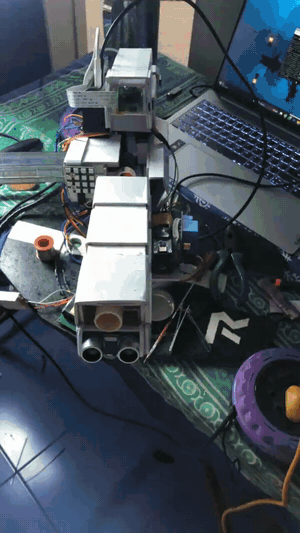

# Raspberry Pi Based Intelligent Human Tracking System

## Overview

This project is a fully handmade intelligent tracking platform developed using Raspberry Pi 4, computer vision, embedded systems, and custom mechanical fabrication.

The system performs real-time human face detection and tracking using a Raspberry Pi Camera V2 and automatically adjusts a pan-tilt mechanism to keep the target centered within the field of view.

The complete mechanical structure was designed and fabricated manually, including the custom hardware assembly and integration of multiple electronic subsystems.

The project integrates computer vision, robotics, electronics, embedded software, and mechanical prototyping into a single autonomous system.

More than **250+ hours** were invested in designing, fabricating, programming, integrating, testing, and refining the system.

---

## Key Features

* Real-time human face detection using computer vision.
* Automated pan-tilt tracking using servo motors.
* Intelligent target centering and tracking.
* LCD-based system status display.
* Human presence alert through speaker module.
* Proximity sensing for environmental awareness.
* RGB LED matrix visual indication during human detection.
* Custom handmade mechanical assembly and housing.
* Integrated multi-component embedded system architecture.

---

## Project Images

### Complete System Assembly

---

## Demonstration

---

## Hardware Components

The following images summarize the hardware components used during system development.

### Major Components Used

* Raspberry Pi 4 (4GB RAM)
* Raspberry Pi Camera V2
* PCA9685 16-Channel Servo Driver
* Servo Motors (x3)
* US-100 Ultrasonic Sensor
* LCD2004 Display
* WS2812B 4x4 RGB LED Matrix
* 5V Dual Channel Relay Module
* LM2596S DC-DC Buck Converter
* Digital Speaker Module
* 18650 Lithium Batteries
* 18650 Charging Module
* Mini Breadboard
* Male-to-Male Jumper Wires
* Male-to-Female Jumper Wires
* Female-to-Female Jumper Wires
* Custom Handmade Mechanical Structure

---

## System Operation

1. Raspberry Pi Camera continuously captures video frames.
2. OpenCV detects human faces in real time.
3. Face coordinates are processed by the Raspberry Pi.
4. Pan and tilt servos automatically align the system with the detected face.
5. LCD display shows system information such as human detection status and sensor readings.
6. Ultrasonic sensor provides proximity information.
7. Speaker module generates an alert when a human is detected.
8. RGB LED matrix displays visual alert patterns during detection events.

---

## Software Stack

* Python
* OpenCV
* Raspberry Pi OS
* PCA9685 Servo Control Library
* GPIO Programming

---
## Software Modules

### my_led_patterns.py
Contains custom NeoPixel LED patterns used to provide visual feedback during different system states such as standby mode, human detection, and system alerts.

### shooting_mechanism.py
Implements the projectile launching mechanism by controlling the relay module and actuator sequence responsible for launching soft projectiles upon user authorization.

### hcsr04_distance.py
Interfaces with the HC-SR04/US-100 ultrasonic sensor to perform real-time distance measurements, enabling proximity awareness and environmental sensing.

### i2c_scan.py
Utility script used to scan and identify I2C devices connected to the Raspberry Pi, assisting in hardware integration, device verification, and troubleshooting.

### relay_test.py
Standalone testing utility developed to validate relay module operation and ensure reliable switching performance before system integration.

### servo_te6st.py
Servo calibration and testing utility used to verify smooth pan-tilt movement, actuator response, and overall servo performance.

## Future Improvements

* Object classification using deep learning.
* Multi-target tracking.
* Improved autonomous decision-making.
* Enhanced mechanical stabilization.
* Wireless remote monitoring and control.
